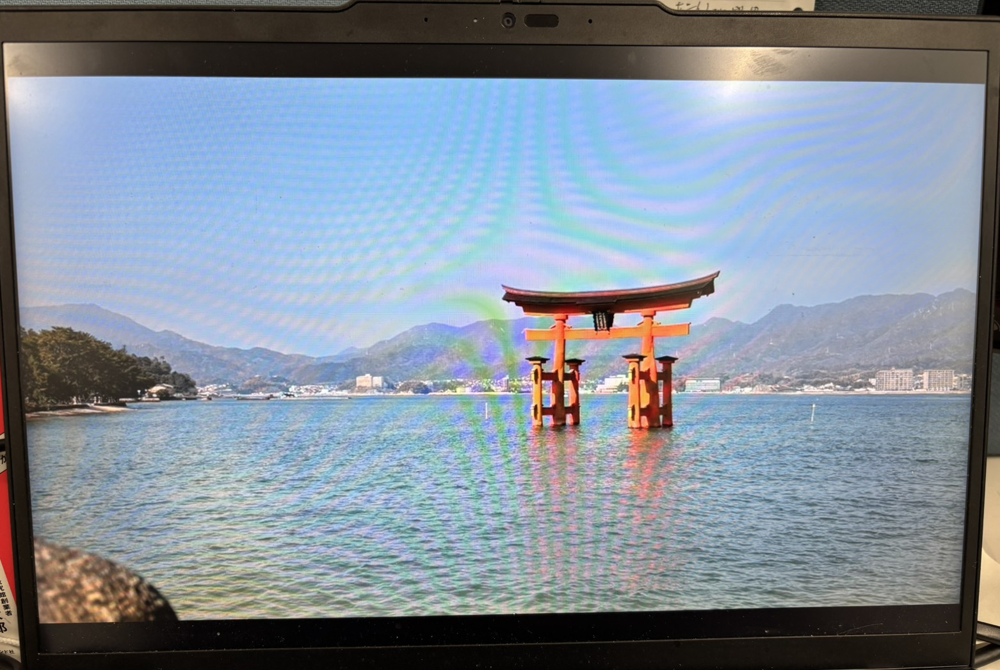
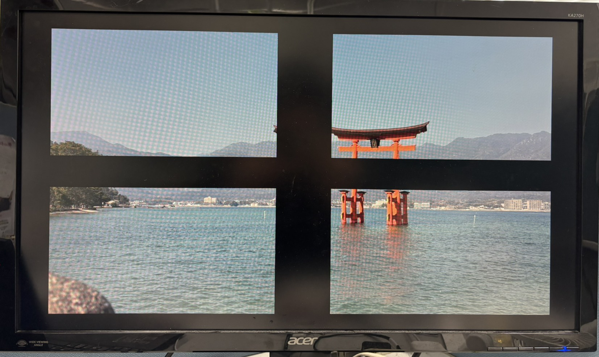

# FPGA-Quad-Frame-Remapper-PYNQ-Z1
本プロジェクトは、FPGAボード「PYNQ-Z1」を用いた映像処理の実装例である。 PCから入力された1920×1080のHDMI映像をDDRメモリへ格納し、自作HLS IPにより画面を4分割・縮小（0.8倍）・中央再配置した後、外部ディスプレイへリアルタイム出力する。  本プロジェクトは、単純なHDMIパススルーの拡張として、DDRフレームバッファを活用した座標再配置型映像処理の実装例となっている。

本プロジェクトは、FPGAボード「PYNQ-Z1」を用いた映像処理アクセラレータの実装例である。
PCから入力された1920×1080のHDMI映像をDDRメモリへ格納し、自作HLS IPにより画面を4分割・縮小（0.8倍）・中央再配置した後、外部ディスプレイへリアルタイム出力する。

本プロジェクトは、単純なHDMIパススルーの拡張として、DDRフレームバッファを活用した座標再配置型映像処理の実装例となっている。

---

## 処理フロー
HDMI入力
→
dvi2rgb
→
Video In to AXI4-Stream
→
VDMA (S2MM) → DDR
→
自作HLS IP（quad_frame_remapper）
→
VDMA (MM2S)
→
AXI4-Stream to Video Out
→
rgb2dvi
→
HDMI出力

---

# 実行結果
## PC入力画面（HDMI入力）

  

PCから入力された1920×1080のフルHD映像。

---

## 外部ディスプレイ出力（Quad Frame Remapper適用後）

  

画面を4分割し、各象限を0.8倍に縮小して中央配置した出力結果。
余白部分は黒で埋められている。

---

# 開発環境

## ハードウェア

- FPGAボード：PYNQ-Z1
- FPGAデバイス：Xilinx Zynq-7000 XC7Z020

## ソフトウェア

- OS：Windows 11
- AMD Vivado 2025.1
- AMD Vitis 2025.1

---

# 技術的特徴

## 1. DDRフレームバッファ活用

本プロジェクトではストリーム型処理ではなく、DDRメモリを介したランダムアクセス型映像処理を実装している。

これにより、以下のような高度な処理への拡張が可能だと考えられる。

- 画素座標の再配置を伴うような映像処理
- 映像の分割・複製・縮小拡大処理
- マップファイルを用いたLUT式映像処理

---

## 2. HLSによるIP設計

自作IP `image_quad_scale` はVitis HLSで設計している。

- AXI4 Master (m_axi) によるDDRアクセス
- AXI4-Lite制御ポート
- 128bit幅アクセス

---

# 実行方法

1. 空のフォルダ（例：project_quad）を準備する  
2. 本プロジェクトをダウンロードし配置する  
3. Vivadoで `.xpr` ファイルを開く  
4. ビットストリームを生成する  
5. Export Hardware（XSA生成）  
6. Vitisを起動しWorkspaceに `vitis_embedded_workspace` を指定  
7. platform と component をBuildする  
8. PC → PYNQ-Z1 HDMI入力  
   PYNQ-Z1 HDMI出力 → 外部ディスプレイ に接続  
9. PYNQ-Z1の電源を入れる。 
10. Vitis上で実行する。4分割縮小映像が表示される。  

---

# 注意事項

- 本プロジェクトは Vivado / Vitis 2025.1 を前提としている。
- 上記以外の他バージョンでは、正常に動作しない可能性がある。
- 解像度は1920×1080入出力を想定している。
